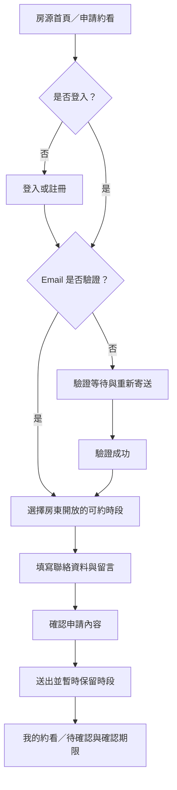
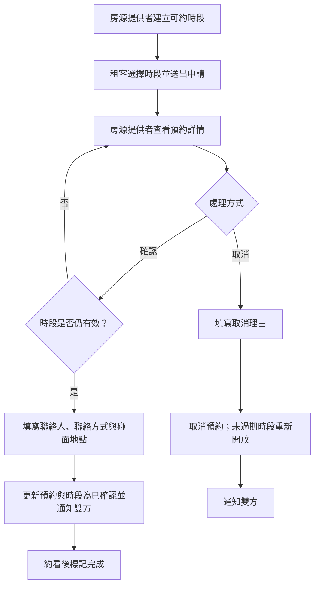

# Findhouse MVP 頁面與資訊架構

- 更新日期：2026-07-11
- 適用範圍：單一房源 MVP

## 1. 網站地圖

```text
公開區
├── 房源首頁
├── 登入
├── 註冊
├── Email 驗證等待／結果
├── 忘記密碼／重設密碼
├── 服務條款
├── 隱私權政策
└── 聯絡方式

會員區
├── 申請約看
├── 申請完成
├── 我的約看
├── 約看詳情
├── 我的房源
├── 收到的預約
└── 可約時段管理

房源提供者區
└── 文件驗證／補件

管理區
├── 後台首頁
├── 可約時段管理
├── 約看列表
├── 約看詳情／處理
├── 文件審核列表
├── 文件審核詳情
└── 房源與圖片管理
```

## 2. 房源首頁內容順序

1. 導覽列：品牌、登入狀態、我的約看。
2. 首屏：封面、租金、關鍵規格、可入住日期、申請約看。
3. 圖片瀏覽：縮圖、全圖檢視、替代文字。
4. 所有權文件驗證狀態與標章說明。
5. 租金、押金與全部費用摘要。
6. 水電、瓦斯、網路及管理費計算方式。
7. 房源特色與租賃範圍。
8. 家具、設備、修繕與已知現況。
9. 生活機能與交通。
10. 租屋條件與合理使用限制。
11. 位置範圍或鄰近地標，不顯示完整門牌。
12. 常見問題。
13. 頁尾：條款、隱私及聯絡方式。

行動版在頁面底部保留固定「申請約看」操作；桌面版可在摘要區保留操作卡片。

房源管理表單依序分為基本資料、租金押金、費用與電費、設備與現況、使用條件、私密地址、照片與文件。電費依「按度」或「非按度」顯示不同條件欄位；禁止內容在儲存時阻擋，不能只顯示警告。

## 3. 申請約看流程



驗證與登入流程必須保留使用者原本目的，完成後回到約看表單。

## 4. 房源提供者處理流程



## 5. 房源提供者後台資訊呈現

### 5.1 後台首頁

- 今日約看：依時間排序，顯示租客、時間、狀態及聯絡方式。
- 待確認申請：顯示件數與最早申請，提供查看詳情入口。
- 待確認申請顯示最晚確認時間，依即將到期順序排列。
- 即將到來：顯示未來已確認約看。
- 通知異常：顯示最近寄送失敗的通知。

### 5.2 可約時段管理

- 依日期分組顯示時段。
- 每筆顯示開始／結束時間、時段狀態及對應租客（若有）。
- 提供新增時段、關閉時段及前往預約詳情操作。
- 狀態為可預約、暫時保留、已確認、已關閉。

### 5.3 預約列表

桌面版使用表格，欄位為日期時間、預約編號、租客、電話、看房人數、申請時間、預約狀態及通知狀態；行動版使用卡片保留相同資訊。

提供日期與狀態篩選，排序優先順序為待確認、即將到來、其餘歷史紀錄。

### 5.4 預約詳情

```text
預約摘要：日期、時間、狀態、預約編號
租客資料：姓名、Email、電話、看房人數
補充內容：租客留言
碰面資訊：聯絡人姓名、聯絡方式、碰面地點、碰面說明
歷程：申請、確認、取消、完成
通知：站內與 Email 寄送結果
操作：確認、取消、標記完成
```

### 5.5 文件驗證與審核

房源提供者頁面顯示目前狀態、標章說明、隱私告知、上傳入口、補件原因及提交歷程。

管理員審核列表依待審核時間排序，顯示房源、提交者、提交時間、文件版本及狀態。審核詳情並列房源資料、提供者資料與受控文件預覽，提供通過、要求補件、撤銷及失效操作。

所有權文件的審核狀態、補件原因及內容不得出現在公開房源頁。公開頁只顯示房源提供者的會員標章。

### 5.6 找房者的預約資訊

「我的約看」列表顯示房源封面與名稱、日期時間、預約編號、狀態、申請時間、待確認期限及適用的取消操作。

預約詳情顯示房源公開資訊、日期時間、預約編號、看房人數、申請時電話與留言、狀態歷程及取消理由。預約確認後另顯示聯絡人姓名、聯絡方式、碰面地點與碰面說明。

介面在距開始不足 12 小時後隱藏租客自行取消操作，改顯示聯絡房源提供者的說明。逾期自動取消需明確顯示系統原因，不得看起來像任一方主動取消。

雙方見面時可核對相同預約編號。介面必須說明預約編號只用於辨識同一筆預約，不代表真實身分已驗證；系統不得提供僅輸入編號即可公開查詢預約的入口。

## 6. 共用介面狀態

每個核心頁面必須設計：

- 載入中
- 無資料
- 權限不足
- 表單驗證失敗
- 伺服器錯誤與可重試操作
- Email 寄送失敗但資料已成功保存
- 工作階段逾期並保留原本操作意圖

## 7. 導覽原則

- 公開導覽不顯示多房源搜尋或地圖入口。
- 登入會員主要入口為「我的約看」；擁有房源時另顯示「我的房源」、「收到的預約」與「可約時段」。
- 管理員另顯示「全站會員」、「全站房源」、「全部預約」、「文件審核」與「管理紀錄」。
- 不以瀏覽器返回鍵作為唯一離開表單的方法。
- 重要狀態頁提供明確下一步，而非只顯示成功或失敗文字。
