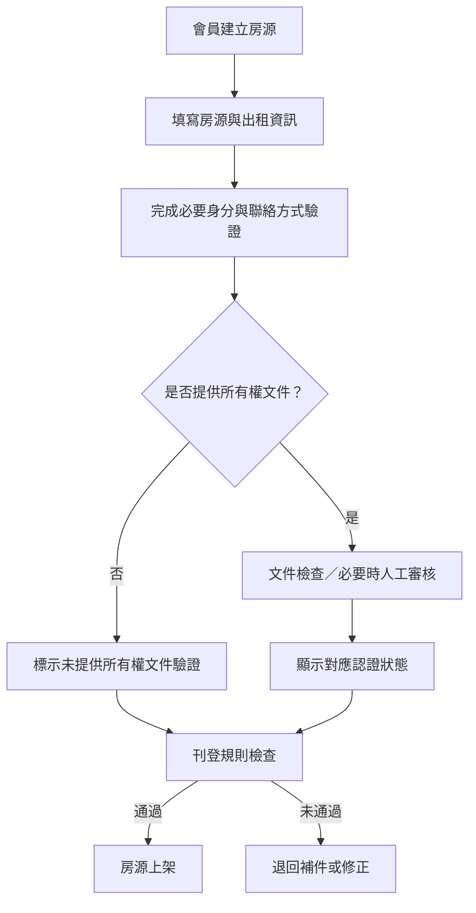
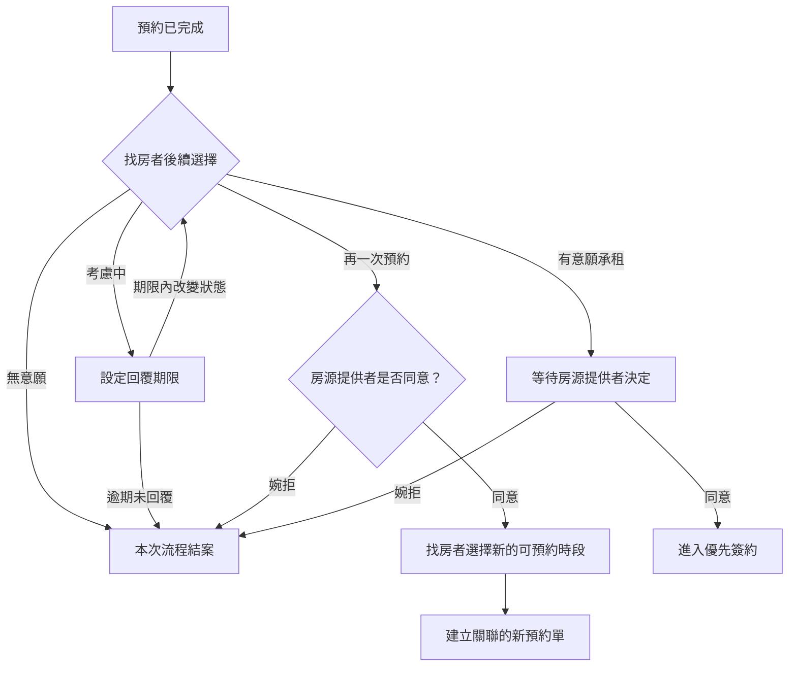
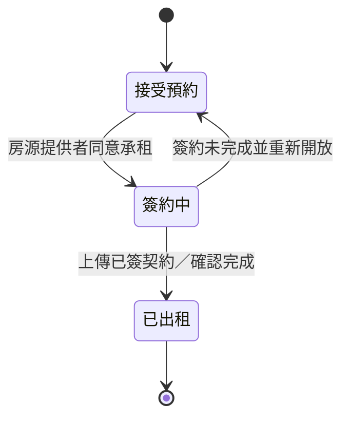

# Findhouse 產品流程與平台規則

- 文件狀態：未來完整產品藍圖（非目前 MVP 開發範圍）
- 更新日期：2026-07-11
- 適用市場：台灣長期住宅租賃
- 暫定名稱：Findhouse

> 目前開發範圍以 [單一房源 MVP 規格](MVP_SPEC.md) 為準。本文件保留多房源、認證、承租、候補與契約等未來方向，不應直接視為第一版驗收需求。

## 1. 產品目的

Findhouse 的第一階段目標，是讓房源提供者與找房者直接在平台完成以下流程：

1. 建立可信任的會員資料。
2. 建立並刊登房源。
3. 設定及預約可帶看時段。
4. 記錄每一次看房與後續意願。
5. 管理優先簽約者及候補者。
6. 產生紙本契約資料並保存簽署後的影像備份。

產品價值不只來自房源數量，也來自可驗證的資訊、清楚的預約秩序，以及不必反覆填寫的承租流程。

## 2. 平台定位與責任邊界

### 2.1 平台提供的服務

- 房源資訊刊登及搜尋
- 會員資料完整度與認證標章
- 房源文件提供狀態的揭露
- 帶看預約與狀態管理
- 承租意願傳遞與候補管理
- 契約編輯、產生、下載及列印工具
- 紙本契約影像上傳與備份
- 站內通知及電子郵件通知

### 2.2 平台不等同仲介

平台原則上僅提供資訊、預約及文件工具，不主動進行下列行為：

- 代表任一方介紹、磋商或議價
- 代替出租方決定租客
- 代替租客作成承租決定
- 收取以成交為條件的仲介報酬
- 保證房源、會員、契約或交易一定真實有效
- 代收租金、押金或其他交易款項

實際執行仲介或受託出租行為的人，應自行確認具備所需資格、委託文件及法定程序。平台上的房源提供者也必須揭露自己是屋主、合法代理人、受託房仲或其他身分。

### 2.3 契約成立原則

- 平台中的「有意願承租」「房東同意」及「進入簽約」屬於流程狀態，不直接代表租賃契約已成立。
- 第一階段以雙方實際完成的紙本租賃契約作為最終簽約依據。
- 平台提供的契約內容與文件工具僅供雙方準備及保存使用。

## 3. 會員與身分架構

### 3.1 單一會員制度

平台不在註冊時永久區分「房東帳號」與「房客帳號」。同一會員可以：

- 瀏覽及預約房源
- 對房源提出承租意願
- 在符合刊登條件後建立及管理房源

角色由當下行為決定：刊登房源時是「房源提供者」，預約或提出承租時是「找房者」。

### 3.2 基本會員資料

會員資料原則上集中保存，預約時直接帶入，避免每次看房重複填寫。

建議第一階段資料：

- 姓名
- 手機號碼及驗證狀態
- 電子郵件及驗證狀態
- 身分驗證狀態
- 必要的租屋自我介紹或承租資訊
- 平台條款與隱私權政策同意紀錄

預約表單的聯絡電話直接取用會員已驗證的手機號碼，不另外要求填寫。若要更換電話，應回會員資料完成驗證後再預約。

### 3.3 管理員

- 管理員是獨立系統角色，不等同房東或房源提供者。
- 管理員可依管理職責查看及處理全站會員、房源、預約、驗證文件、通知與異常紀錄。
- 密碼原文、驗證 token、登入 session 與服務金鑰不得提供管理員介面查看。
- 管理員查看敏感文件、修改資料、審核、撤銷標章或停權時，應留下操作者、時間與理由紀錄。
- 管理員權限由系統設定，一般會員不得自行取得。

## 4. 信任與認證機制

### 4.1 設計原則

- 不建立主觀的「好房東／壞房東」或「好房客／壞房客」公開評分。
- 平台只根據資料完整度、驗證項目與可確認的行為顯示狀態。
- 認證標章表示特定資料已完成平台規定的驗證，不代表平台保證人格、付款能力、房屋品質或履約結果。

### 4.2 會員認證

會員標章分為三個等級：

- 灰色「普通會員」：完成註冊即取得。
- 綠色「認證會員」：完成身分驗證與 Email 驗證後取得。
- 藍色「證照會員」：完成會員認證，且提交的證照文件通過平台審核後取得。
- 金色「房源已審核」：房源主要資料與公開內容通過平台審核後取得。

公開頁需提供標章說明入口。會員標章只表示指定資料已依平台流程完成驗證，不代表平台保證會員的專業能力、付款能力、履約能力或交易安全。

### 4.3 房源提供者與所有權文件

- 平台不強迫所有刊登者上傳房屋所有權狀影本。
- 所有權文件可作為平台內部審核資料，但現階段不建立房源標章等級，也不在公開頁以標章呈現。
- 未提供權狀者仍可依其他刊登規則申請刊登，不得讓使用者誤認未提供文件就等於詐騙。

### 4.4 人工審核原則

自動檢查負責先篩選，遇到以下情況再進人工審核：

- 身分或文件辨識失敗
- 姓名、地址、權利人或房源資料不一致
- 圖片疑似翻拍、修改、遮蔽過多或重複使用
- 同一文件被多個不相關帳號使用
- 房源內容遭檢舉或呈現高風險訊號
- 刊登內容包含不應公開的個資或敏感資訊

人工審核只能依平台可取得的資料判斷，不應宣稱完成政府機關才有權限進行的實體權利認定。

## 5. 文件與敏感資訊規則

### 5.1 文件處理

- 身分證、權狀及契約影像不得公開顯示原始檔。
- 預覽畫面應遮蔽身分證字號、完整地址以外的不必要個資、印章及其他敏感欄位。
- 上傳後應自動加入用途浮水印，例如「僅供 Findhouse 身分／房源驗證使用」及上傳日期。
- 文件應限制存取權限、保留存取紀錄，並設定保存期限及刪除機制。
- 不要求使用者將個人印章上傳平台。

### 5.2 自動檢查範圍

**刊登狀態檢查**

- 必填欄位是否完成
- 房源是否重複刊登
- 是否仍可預約、簽約中、已出租、下架或遭停權
- 圖片、租金、地址及設備資料格式是否合理

**文件檢查**

- 是否已提供規定文件
- 文件類型、清晰度與有效期限
- 文件姓名、地址與會員／房源資料是否一致
- 是否有明顯裁切、遮蔽或疑似竄改情況

**敏感資訊檢查**

- 公開描述或照片是否出現身分證字號、電話、電子郵件、銀行帳號或印章
- 權狀及契約預覽是否已遮蔽非必要個資
- 房屋照片是否意外拍到私人文件或可辨識的第三人資料

## 6. 房源建立與刊登流程

房源欄位及刊登檢查應參考內政部現行住宅租賃定型化契約應記載及不得記載事項，尤其租賃標的、租金、押金、費用、電費、設備、修繕、使用限制及禁止約款。MVP 的具體欄位以 [房源欄位與刊登規則](PROPERTY_FIELDS.md) 為準；正式上線前仍需由台灣執業律師確認。

### 6.1 刊登前必要條件

- 已完成平台要求的聯絡方式及身分驗證
- 已揭露刊登者與房源的關係
- 已完成房源必要欄位
- 已同意房源真實性、合法出租及資訊更新義務
- 已通過公開內容、敏感資訊與基本風險檢查

所有權狀影本屬於可提高信任程度的選擇性驗證，不是第一階段所有房源的強制刊登文件。

### 6.2 房源主要狀態

- 草稿
- 待檢查
- 待補件
- 已上架／接受預約
- 簽約中／停止新預約
- 已出租
- 已下架
- 暫停或違規停權

狀態變更應保留時間、操作者與理由紀錄。

## 7. 可預約時段設定

房源提供者可以：

- 自訂可預約日期與開始時間
- 設定每一場帶看的時間長度
- 第一階段每場最短為 1 小時
- 關閉尚未被預約的時段
- 查看當日預約數量與預約者資料

系統依設定產生可選時段，找房者只能從仍有名額且未關閉的時段中選擇。已成立的預約若需變更，必須透過取消或改期流程處理，不能在沒有通知對方的情況下直接消失。

## 8. 預約流程

### 8.1 預約目的

預約時提供三種目的：

- 看房
- 簽約
- 其他

選擇「其他」時應補充簡短說明。

### 8.2 找房者送出預約

預約資料包含：

- 房源
- 預約目的
- 選擇的日期與時段
- 會員姓名
- 從會員資料自動帶入的已驗證手機
- 必要備註
- 本房源的累計預約／看房次數

系統沿用會員與先前預約資料，不要求重複填寫相同基本資料。

### 8.3 房源提供者處理

房源提供者可將預約設為：

- 成立
- 取消

取消時必須填寫理由。系統需同步發送：

- 平台內通知
- 會員訊息中心通知
- 電子郵件通知

第一階段是否增加簡訊或即時通訊通知，列為後續決策。

### 8.4 預約狀態

- 待房源提供者確認
- 已成立
- 已取消
- 已完成
- 待找房者回覆意願
- 已結案

## 9. 看房後意願流程

完成看房後，系統要求找房者在指定期限內選擇下一步：

1. 無意願
2. 考慮中
3. 再一次預約
4. 有意願承租

### 9.1 無意願

- 本次預約流程結案。
- 保留歷史紀錄，不再要求其他表單。

### 9.2 考慮中

- 系統設定明確回覆期限。
- 期限內可改為無意願、再次預約或有意願承租。
- 超過期限仍未回覆，一律視為無意願並結案。
- 期限長度尚待產品決策，不在第一版文件中假定數值。

### 9.3 再一次預約

- 先送出再次預約請求，不直接占用新時段。
- 房源提供者婉拒時，本次流程結案。
- 房源提供者同意後，找房者才可從該房源目前提供的時段中選擇。
- 選定後建立新的預約單，並與原預約建立關聯。
- 房源提供者可看到累計看房次數及每次預約結果。
- 會員基本資料沿用，不需重新填寫。

### 9.4 有意願承租

- 狀態改為等待房源提供者同意。
- 房源提供者同意後，該找房者進入「優先簽約」。
- 房源提供者婉拒時，本次流程結案。

## 10. 直接承租

找房者不一定要先完成帶看，也可以在房源允許時直接提出承租意願。

- 直接承租只是提交意願，不等於契約成立。
- 提交後進入與「看房後有意願承租」相同的審核流程。
- 房源提供者同意後才進入優先簽約。
- 平台應提醒找房者自行確認房況、出租人身分及契約內容。

## 11. 優先簽約與候補

- 同一房源同一時間只設一位優先簽約者。
- 其他已表達承租意願者進入候補。
- 房源進入簽約中後，停止接受新的預約。
- 已成立但尚未完成的既有預約如何處理，必須依平台通知規則辦理，不能靜默取消。
- 優先簽約失敗後，是否自動通知下一順位候補者，以及候補排序方式，列為待決策事項。

房源狀態流程：

## 12. 契約與文件備份

### 12.1 進入簽約時

當房源提供者同意承租：

- 系統依雙方及房源資料產生契約草稿。
- 將契約資料提供雙方審閱。
- 允許下載及列印。
- 保留契約版本、產生時間及下載紀錄。

### 12.2 第一階段簽署方式

- 第一階段不自建電子簽章。
- 雙方以紙本完成確認及簽署。
- 簽署後可上傳掃描檔或清楚的契約照片作為平台備份。
- 上傳備份不代表平台已確認簽名、印章或契約效力。
- 原始紙本仍由雙方自行保存。

### 12.3 未來電子簽署

電子簽署可列入後續階段，優先評估合格第三方服務，再決定是否自行開發。導入前需確認身分驗證、簽署意願、文件完整性、時間證明、稽核軌跡與長期保存要求。

## 13. 通知規則

以下事件至少發送站內及電子郵件通知：

- 預約已送出
- 預約成立
- 預約遭取消及取消理由
- 預約即將開始
- 看房後等待回覆
- 考慮期限即將到期
- 再次預約獲同意或遭婉拒
- 承租意願獲同意或遭婉拒
- 進入優先簽約或候補
- 契約資料已可審閱及列印
- 房源重新開放、已出租或下架

每則通知應連回對應房源、預約單或簽約流程，並保留發送狀態。

## 14. 平台規則摘要

### 14.1 會員義務

- 提供真實、可聯絡且持續更新的資料。
- 不得冒用他人身分、文件、房源或照片。
- 不得在公開欄位揭露不必要的個資。
- 應依約出席預約；無法出席時應及早取消。
- 不得利用平台進行詐欺、騷擾、歧視或其他違法行為。

### 14.2 房源提供者義務

- 確認自己有權刊登及安排出租。
- 說明自己與房源的關係。
- 維持租金、設備、限制條件及可租狀態正確。
- 取消預約時提供理由並透過平台通知。
- 不得將平台認證標章描述為政府保證或完整產權證明。

### 14.3 找房者義務

- 使用本人會員資料預約。
- 在期限內回覆看房後意願。
- 不得大量占用時段、惡意爽約或騷擾房源提供者。
- 在簽約前自行確認房況、對方身分、權利文件及契約內容。

### 14.4 平台處置

平台得依風險及違規程度：

- 要求修正或補件
- 暫停房源曝光或預約
- 移除違規內容
- 暫停認證標章
- 限制帳號功能或停權
- 保存必要紀錄並依法配合主管機關

## 15. 隱私與資料治理原則

- 僅蒐集完成服務所需的最低資料。
- 註冊前應讓使用者確認服務條款與隱私權政策。
- 清楚說明資料用途、保存期限、分享對象及刪除方式。
- 房源雙方只在流程必要階段取得必要聯絡資訊。
- 驗證文件與公開會員資料分開保存及控管。
- 敏感文件應加密、限制內部權限並留下存取紀錄。
- 使用者應能查看及修正一般會員資料，並依法提出刪除或停止利用請求。
- 契約備份涉及雙方資料，刪除、下載及存取權需另訂明確規則。

## 16. 第一階段範圍

### 16.1 納入

- 單一會員與資料沿用
- 會員及房源提供者認證狀態
- 選擇性所有權文件驗證
- 房源刊登、搜尋與狀態管理
- 可帶看時段及最短一小時設定
- 看房／簽約／其他預約目的
- 預約成立、取消、理由與通知
- 看房後四種意願
- 再次預約及看房次數紀錄
- 直接承租
- 一位優先簽約者及其他候補
- 簽約中停止新預約
- 契約草稿、下載、列印及紙本影像備份

### 16.2 暫不納入

- 自建電子簽章
- 平台代收付款
- 租後收租、催租、報修及完整物業管理
- 公開星等或主觀好壞評分
- 政府資料庫即時產權查驗的保證
- 平台提供仲介、議價或成交保證
- 老屋翻新、水電、清潔服務的完整媒合流程

老屋翻新、水電及清潔可作為後續服務層，但不應阻礙第一階段把房源、預約與承租流程做完整。

## 17. 待決策事項

以下項目尚未定案，進入畫面與系統設計前應逐項確認：

1. 「考慮中」的回覆期限是固定天數，還是由房源提供者設定。
2. 房源提供者確認一般預約的回覆期限，以及逾期處理方式。
3. 每個時段是一組帶看還是一位租客，是否允許設定同時帶看人數。
4. 預約改期是取消後重訂，還是提供獨立改期流程。
5. 爽約的定義、申訴方式與功能限制門檻。
6. 優先簽約期限與延長規則。
7. 候補排序、通知及遞補方式。
8. 進入簽約中時，既有已成立預約是否照常進行。
9. 紙本契約完成的確認方式，以及是否必須雙方都確認。
10. 契約影像的保存期限、刪除權與雙方下載權限。
11. 所有權文件實際檢查方式、標章名稱與有效期限。
12. 房仲或代理刊登所需的揭露及委託文件。
13. 平台營收模式，以及是否可能跨入不動產仲介報酬的法律界線。
14. 簡訊、LINE 或其他即時通知是否納入第一階段。

## 18. 後續文件

本規格確認後，建議依序建立：

1. 使用者旅程與服務藍圖
2. 頁面與資訊架構
3. 預約及簽約狀態表
4. MVP 功能清單與驗收條件
5. 資料欄位及權限矩陣
6. 服務條款
7. 隱私權政策
8. 房源刊登規範與認證標章說明
9. 通知文案與例外情境
