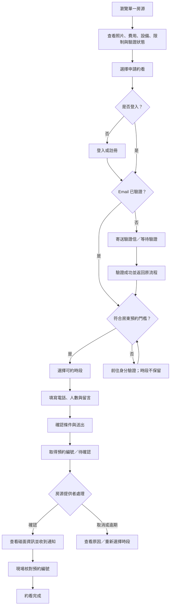
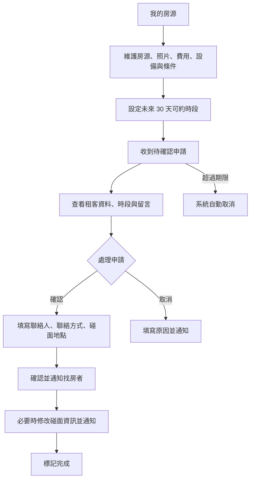
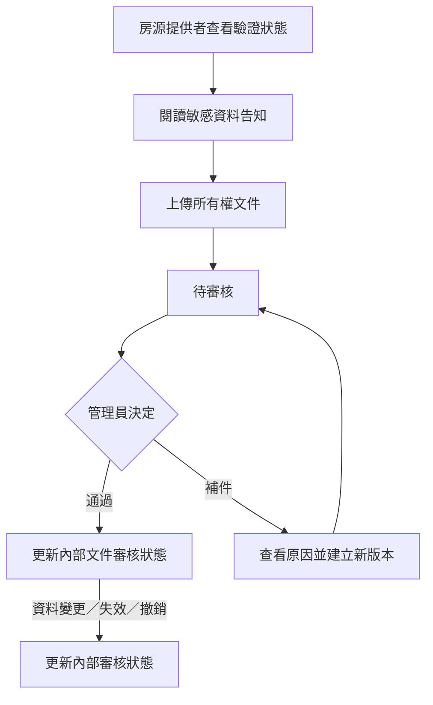
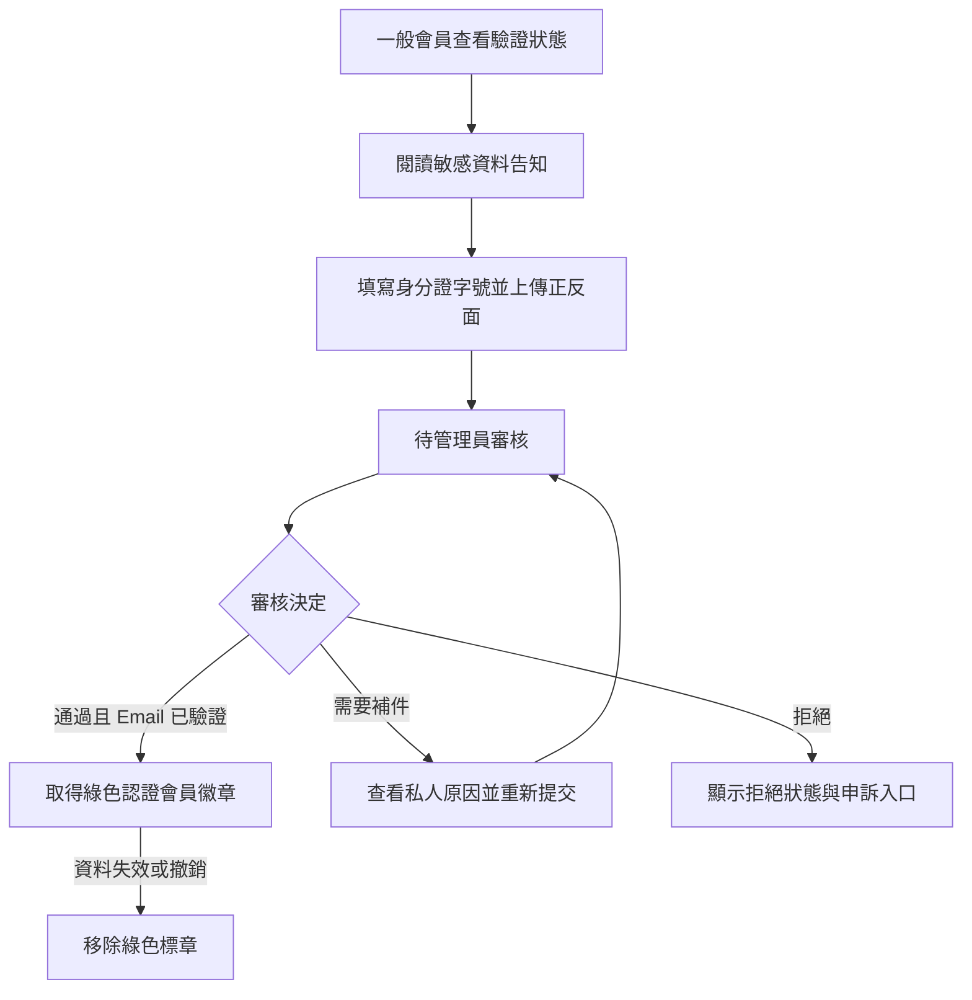
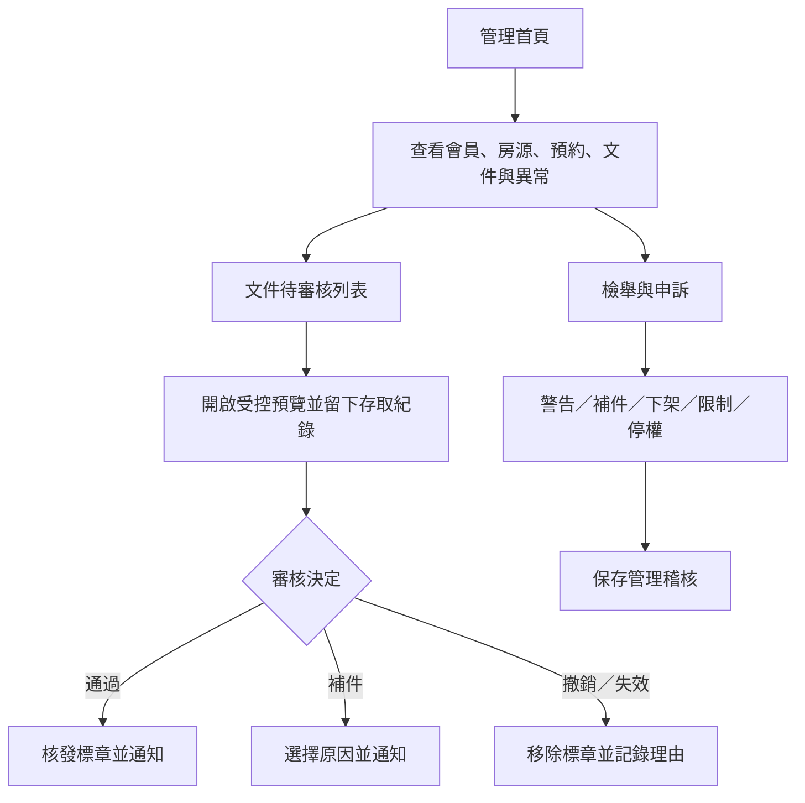

# Findhouse MVP 使用者流程

- 文件狀態：低保真體驗基準
- 更新日期：2026-07-11

## 1. 找房者流程

### 1.1 中斷與返回

- 註冊、登入或 Email 驗證完成後，返回原房源與約看步驟。
- 時段在送出前被他人占用時，保留已填電話、人數與留言，返回時段選擇。
- 工作階段逾期時，重新登入後恢復尚未送出的表單草稿；不自動建立預約。

## 2. 房源提供者流程

### 2.1 時段管理

- 每場固定 60 分鐘，只能建立未來 30 天時段。
- 已被申請的時段不可直接刪除或靜默關閉。
- 取消後距開始至少 12 小時才重新開放，否則關閉。

## 3. 所有權文件流程

## 3A. 會員身分驗證流程

身分驗證不是約看門檻；租客完成 Email 驗證後即可申請約看。

## 4. 管理員流程

## 5. 角色切換與導覽

- 所有登入會員顯示「我的約看」。
- 擁有房源的會員另顯示「我的房源」、「收到的預約」與「可約時段」。
- 管理員另進入獨立管理區，不在一般會員畫面混入全站資料。
- 同一會員不得預約自己提供的房源。
